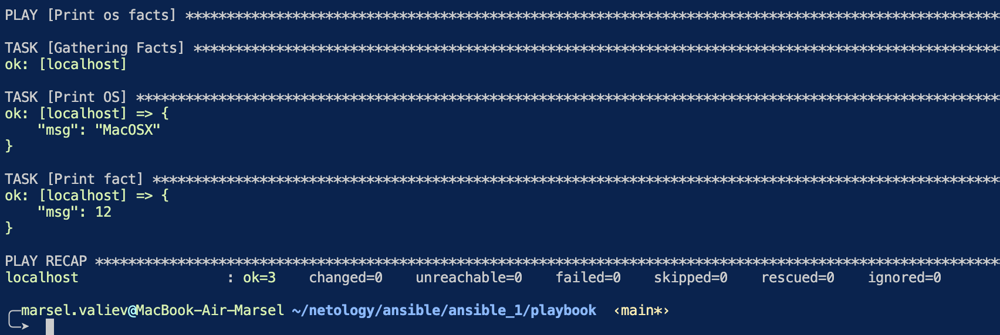
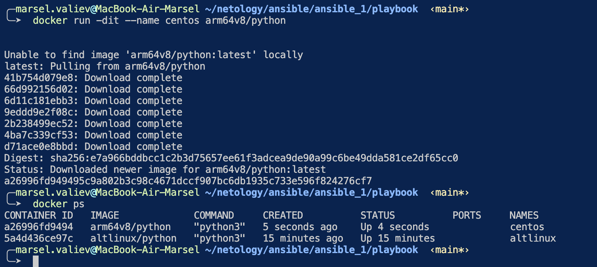
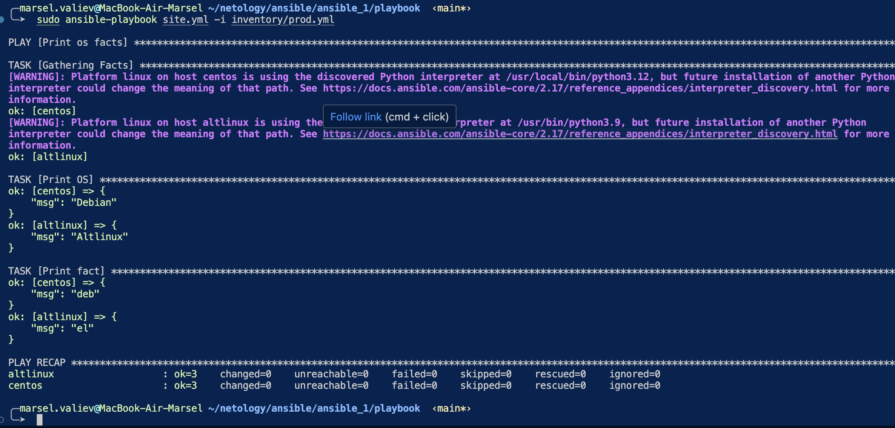
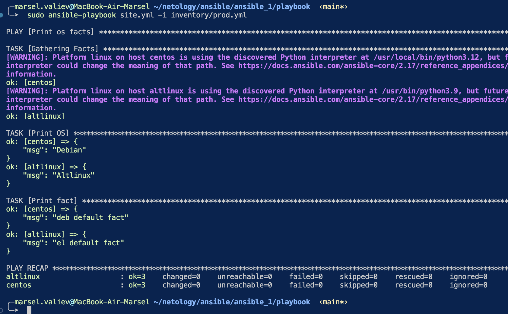
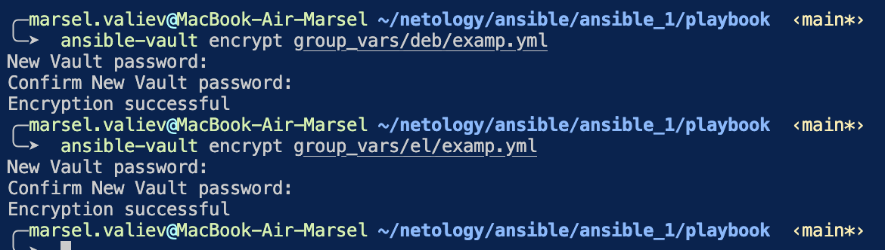
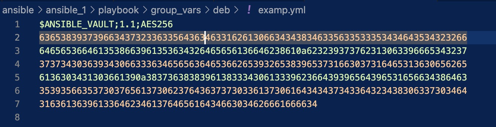
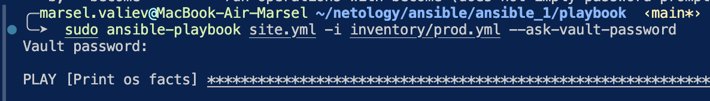
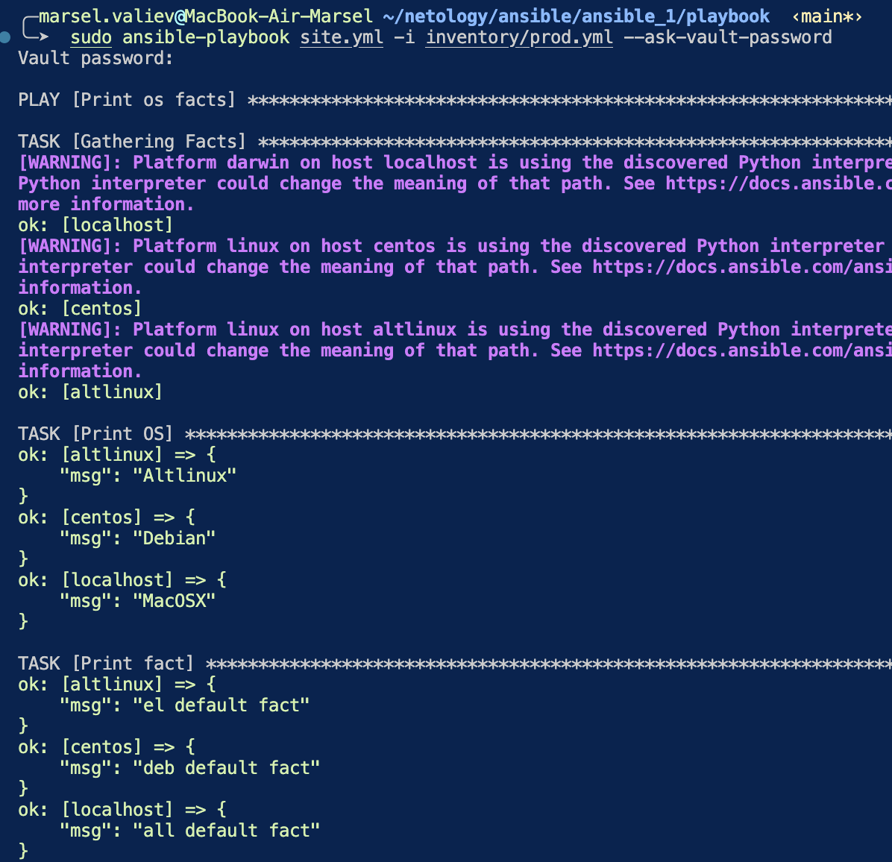

### Попробуйте запустить playbook на окружении из test.yml, зафиксируйте значение, которое имеет факт some_fact для указанного хоста при выполнении playbook.

### Воспользуйтесь подготовленным (используется docker) или создайте собственное окружение для проведения дальнейших испытаний.

### Проведите запуск playbook на окружении из prod.yml. Зафиксируйте полученные значения some_fact для каждого из managed host.

### Добавьте факты в group_vars каждой из групп хостов так, чтобы для some_fact получились значения: для deb — deb default fact, для el — el default fact.

### При помощи ansible-vault зашифруйте факты в group_vars/deb и group_vars/el с паролем netology.

### Запустите playbook на окружении prod.yml. При запуске ansible должен запросить у вас пароль. Убедитесь в работоспособности.

### Посмотрите при помощи ansible-doc список плагинов для подключения. Выберите подходящий для работы на control node.
### В prod.yml добавьте новую группу хостов с именем local, в ней разместите localhost с необходимым типом подключения.
### Запустите playbook на окружении prod.yml. При запуске ansible должен запросить у вас пароль. Убедитесь, что факты some_fact для каждого из хостов определены из верных group_vars.

