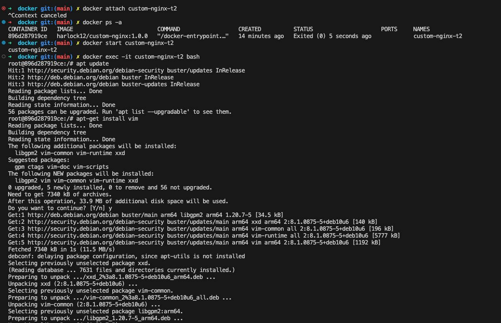
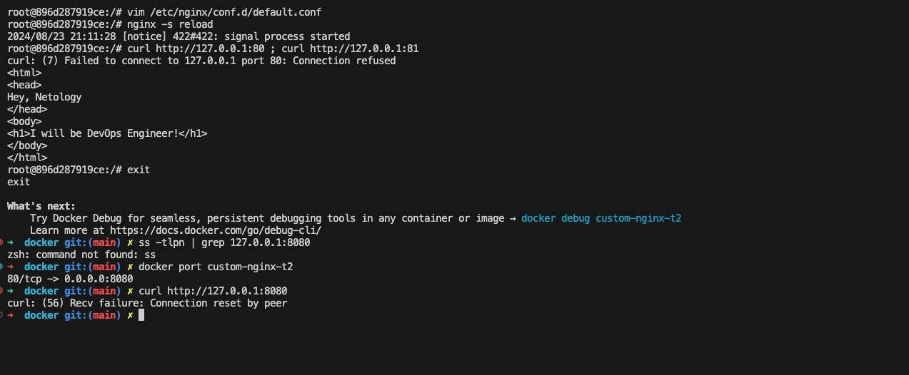
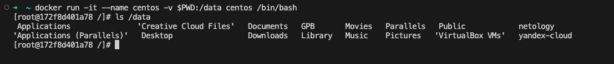
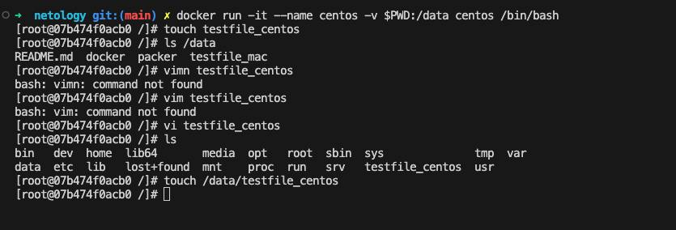
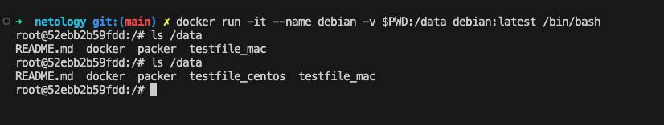
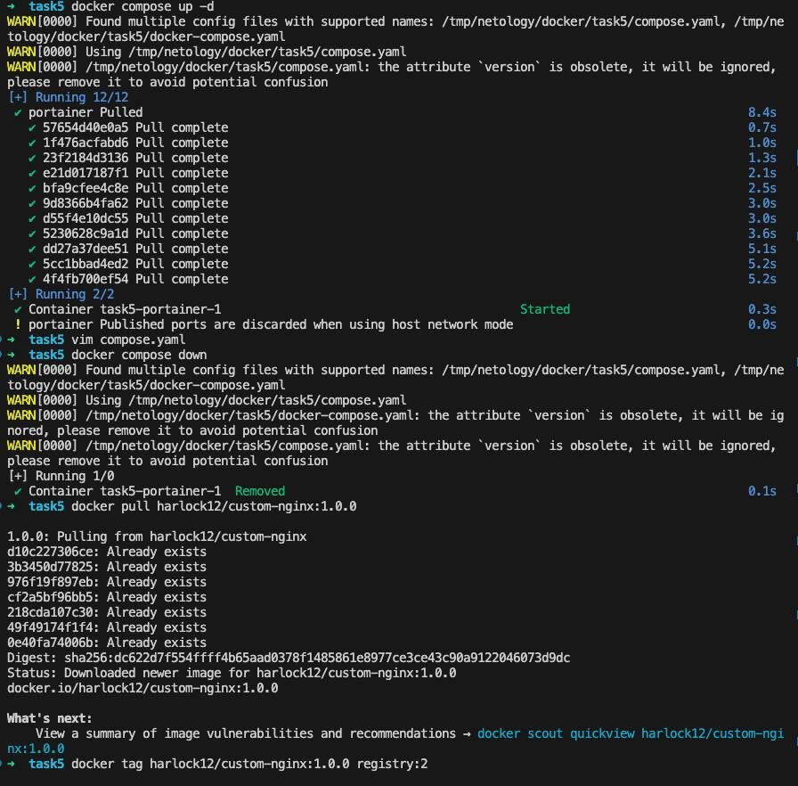
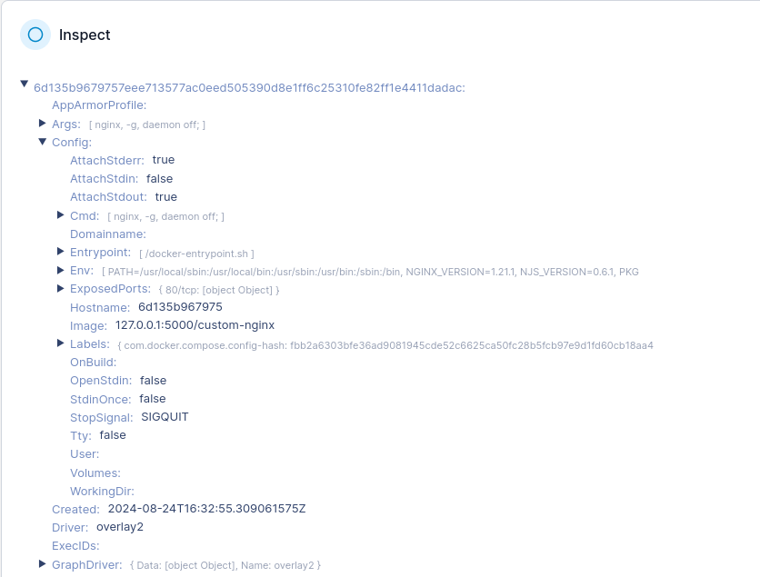
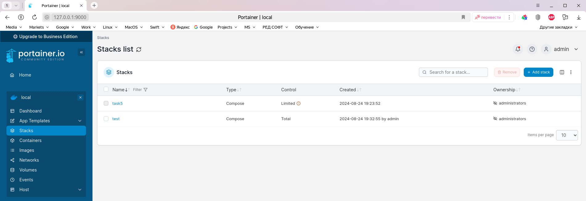

# Домашнее задание. «Оркестрация группой Docker контейнеров на примере Docker Compose.»
## Задача 1
https://hub.docker.com/repository/docker/harlock12/custom-nginx/general

## Задача 2

Ответ

## Задача 3

Nginx перестал слушать порт 80

## Задача 4

## Задача 5

