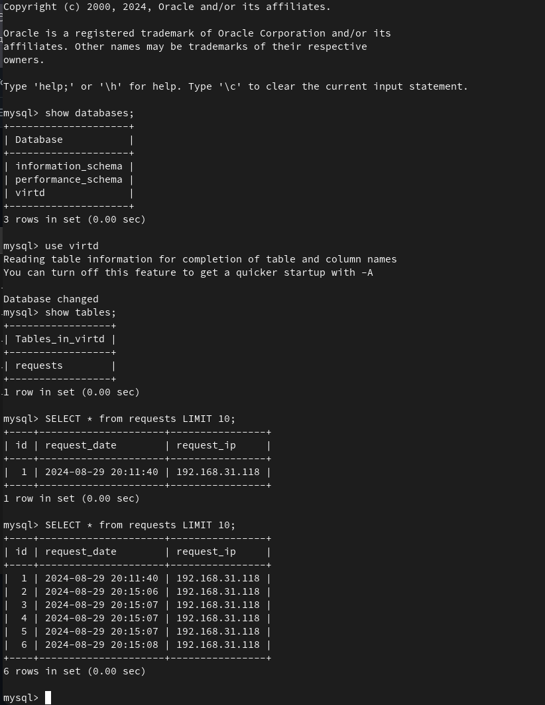

# Домашнее задание по занятию "Практическое применение Docker"

## Задача 1

Форк с добавленными файлами 
https://github.com/p1ckle-r1ck/shvirtd-example-python

## Задача 3

Приложение возвращает локальный ip address

## Задача 4

### Форк с добавленными файлами 
https://github.com/p1ckle-r1ck/shvirtd-example-python

### Скрипт запуска на Yandex Cloud
    #!/bin/bash
    cd /opt
    git clone https://github.com/p1ckle-r1ck/shvirtd-example-python.git
    cd shvirtd-example-python
    docker compose up -d 

### Скриншот сервера с Yandex Cloud

## Задача 6

### Скриншот Docker Save

### Скриншот Dive

## Задача 6.1
Docker CP

