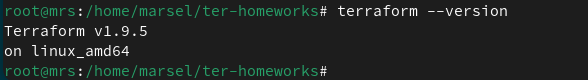
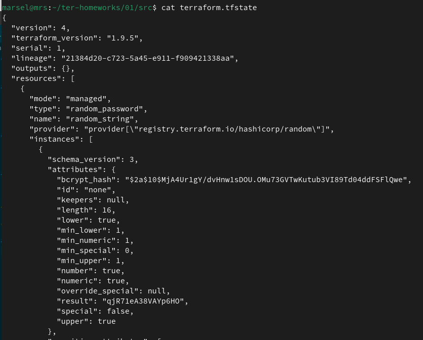
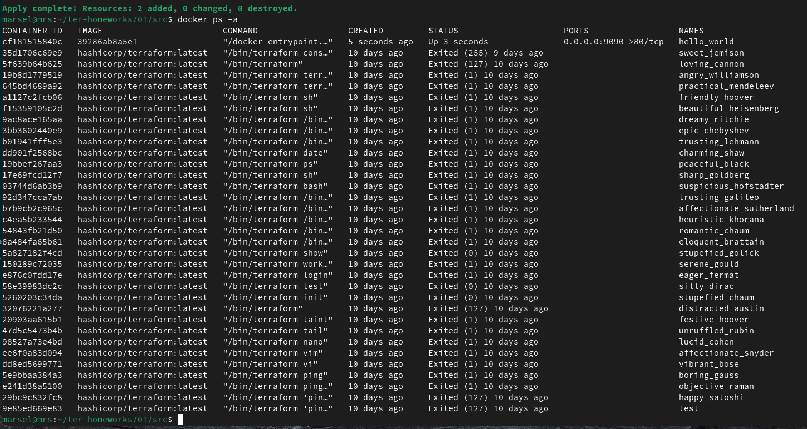
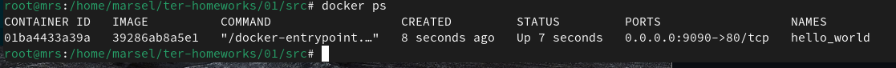
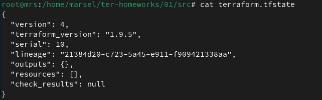

# Домашнее задание. «Введение в Terraform»


### Чек-лист готовности к домашнему заданию

1. Скачайте и установите **Terraform** версии ~>1.8.4 . Приложите скриншот вывода команды ```terraform --version```.

### Ответ



### Задание 1

1. Перейдите в каталог [**src**](https://github.com/netology-code/ter-homeworks/tree/main/01/src). Скачайте все необходимые зависимости, использованные в проекте. 
2. Изучите файл **.gitignore**. В каком terraform-файле, согласно этому .gitignore, допустимо сохранить личную, секретную информацию?(логины,пароли,ключи,токены итд)

### Ответ

В файле **personal.auto.tfvars**

3. Выполните код проекта. Найдите  в state-файле секретное содержимое созданного ресурса **random_password**, пришлите в качестве ответа конкретный ключ и его значение.


### Ответ



4. Раскомментируйте блок кода, примерно расположенный на строчках 29–42 файла **main.tf**.
Выполните команду ```terraform validate```. Объясните, в чём заключаются намеренно допущенные ошибки. Исправьте их.


### Ответ

1.  Ошибка, что имя "должно начинаться с буквы или подчеркивания и может содержать только буквы, цифры, подчеркивания, и тире." Нам необходимо убрать число перед именем рессурса контейнера **1nginx** меняю на **nginx**


2. Не указано имя ресурса docker_image
добавляем "nginx"

3. Ошибка о том, что не обявлен в корневом модуле **"random_password"**. Удаляем **FAKE** и меням **resulT** на **result**


5.Выполните код. В качестве ответа приложите: исправленный фрагмент кода и вывод команды ```docker ps```.


6. Замените имя docker-контейнера в блоке кода на hello_world. Не перепутайте имя контейнера и имя образа. Мы всё ещё продолжаем использовать name = "nginx:latest". Выполните команду terraform apply -auto-approve. Объясните своими словами, в чём может быть опасность применения ключа -auto-approve. Догадайтесь или нагуглите зачем может пригодиться данный ключ? В качестве ответа дополнительно приложите вывод команды docker ps.


7. Уничтожьте созданные ресурсы с помощью terraform. Убедитесь, что все ресурсы удалены. Приложите содержимое файла terraform.tfstate.


8. Объясните, почему при этом не был удалён docker-образ nginx:latest. Ответ ОБЯЗАТЕЛЬНО НАЙДИТЕ В ПРЕДОСТАВЛЕННОМ КОДЕ, а затем ОБЯЗАТЕЛЬНО ПОДКРЕПИТЕ строчкой из документации terraform провайдера docker. (ищите в классификаторе resource docker_image )


Так как используется Keep Locally, хранить образ локально 