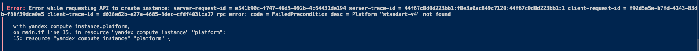
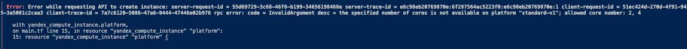
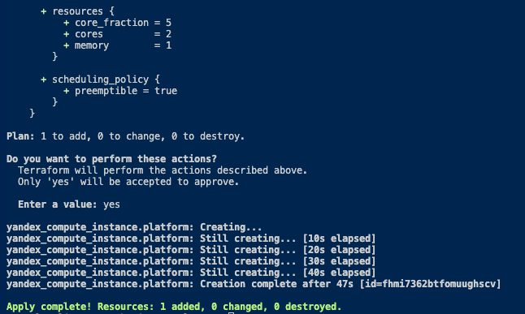

# Домашнее задание. «Введение в Terraform»

### Задание 1 

4. Инициализируйте проект, выполните код. Исправьте намеренно допущенные синтаксические ошибки. Ищите внимательно, посимвольно. Ответьте, в чём заключается их суть.

    Ответ: Не найдена платформа с id "standart-v4", меняем на standard-v1 и появлятеся ошибка количества ядер. Меняем на cores = 2 и все запускается

5. Подключитесь к консоли ВМ через ssh и выполните команду  curl ifconfig.me. Примечание: К OS ubuntu "out of a box, те из коробки" необходимо подключаться под пользователем ubuntu: "ssh ubuntu@vm_ip_address". Предварительно убедитесь, что ваш ключ добавлен в ssh-агент: eval $(ssh-agent) && ssh-add Вы познакомитесь с тем как при создании ВМ создать своего пользователя в блоке metadata в следующей лекции.;
    
    Ответ: 

6. Ответьте, как в процессе обучения могут пригодиться параметры preemptible = true и core_fraction=5 в параметрах ВМ.

    Ответ: Для прерывания ВМ после 24 часов или при нехватке ресурсов. Так же для ограничеия использвоания ресурсов

### Задание 2

1.